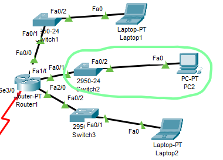

# VLSM

#### In questo esercizio abbiamo usato il VLSM (Variable-Length Subnet Mask), abbiamo replicato un esercizio che si trovava su delle slide condivise dal prof

#### Quindi abbiamo preso questo esercizio e replicato su Packet Tracer
  Abbiamo messo tre router dove due di questi avevano collegate 3 sottoreti mentre uno connetteva i due router con le sottoreti(vedere immagine)
                         
   Questo è il router che collegava gli altri due tramite i cavi seriali per fare comunicare le due reti, quindi usare il router di mezzo, bisognava usare la Routing-Table(cosa che non vedremo in questo esercizio)

Ora vdremo le varie configurazioni delle sei sottoreti, prima guarderemo la prima rete che è composta da 3 sottoreti, la prima sottorete partendo dall'alto ha come configurazione 192.168.1.0/27, la seconda 192.168.1.0./28,
la terza è ultima sottorete 192.168.1.0/26

 192.168.1.0/27  

 192.168.1.0/28

 192.168.1.0/26

#### Dopo aver configuato la prima sottorete proviamo ad avviare la simulazione e vedere se i pacchetti arrivano da un computer di una sottorete fino al computer di un altra sottorete, se funziona tutto come ne mio caso,
#### proseguiamo con la configuarazione della rete 2 in questo caso le CIDR sono sempre le stesse (/27,/28,/26), cambia solo l'ordine in cui sono disposte.

#### Le configuriamo partendo dall'alto

 Prima sottorete 192.168.1.0/27

  Seconda sottorete 192.168.1.0/26

 Terza e ultima sottorete 192.168.1.0/28

#### Anche in questo caso avviare la simulazione per vedere se i pc delle sottoreti comunicano tra loro, per avviare la simulazione bisogna andare in alto e cliccare sulla figura della busta 

